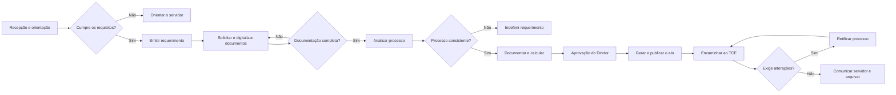

# Projeto GESPREV

O **GESPREV** é um sistema de apoio à gestão de processos de aposentadoria de servidores públicos municipais. O projeto foi desenvolvido como Trabalho de Conclusão de Curso no Instituto Federal Fluminense e busca organizar o fluxo previdenciário, centralizar informações e reduzir atividades manuais relacionadas à documentação e ao cálculo de benefícios.

## Visão Geral

O sistema acompanhará o processo desde o cadastro do servidor e do requerimento até a geração do ato de aposentadoria. Entre suas principais capacidades estarão:

- cadastro e acompanhamento de processos de aposentadoria;
- organização dos documentos obrigatórios por checklist;
- armazenamento e consulta dos documentos vinculados ao processo;
- extração de dados de documentos com apoio de inteligência artificial;
- validação dos dados extraídos antes de sua utilização;
- cálculo de benefício integral ou proporcional;
- registro do histórico de movimentações do processo;
- geração do ato de aposentadoria em PDF;
- controle de acesso para Analista e Diretor;
- consulta experimental de informações previdenciárias por assistente com RAG.

## Contexto do processo

O mapeamento realizado para o projeto descreve o processo institucional de aposentadoria voluntária em sua situação original (**As-Is**) e em uma proposta futura (**To-Be**).

O fluxo To-Be é dividido em etapas principais:

1. **Recepcionar o segurado:** atendimento inicial, orientação, simulação da aposentadoria e emissão do requerimento.
2. **Solicitar documentos:** solicitação, entrega, digitalização e conferência da documentação do servidor.
3. **Prosseguir com o processo:** análise do requerimento e da documentação, com possibilidade de aprovação ou indeferimento.
4. **Documentar o processo:** alinhamento com a legislação, cálculo da média quando aplicável, geração da memória de cálculo e preparação do ato.
5. **Conceder o benefício:** aprovação, publicação do ato, encaminhamento ao Tribunal de Contas e comunicação ao servidor.
6. **Retificar o processo:** realização das alterações exigidas e novo encaminhamento para análise, quando necessário.

> O mapeamento representa o processo institucional completo. A versão do sistema a ser desenvolvida concentra-se principalmente no cadastro, gestão documental, extração de dados, cálculo, histórico e geração do ato. Algumas atividades externas, como publicação e tramitação perante o TCE, permanecem fora da automação atual.

## Perfis do sistema

- **Analista:** cadastra e consulta processos, anexa e valida documentos, acompanha o checklist e gera a memória de cálculo.
- **Diretor:** administra usuários e parâmetros, acompanha os processos, realiza exclusões administrativas e gera o ato final.

Recepcionista, servidor e órgãos externos aparecem no mapeamento do processo, mas não são perfis que serão implementados no GESPREV.

## Tecnologias principais

| Camada | Tecnologias |
|---|---|
| Interface | React, Vite, Material UI e Axios |
| Aplicação | Java, Spring Boot, Spring Security e Spring Data JPA |
| Banco de dados | PostgreSQL e Flyway |
| Inteligência artificial | Spring AI, modelos de linguagem e modelos visuais configuráveis |
| Documentos | PDFBox, iText e Apache POI |
| Autenticação | JWT e senhas protegidas com BCrypt |
| Apoio à busca semântica | Python, FastAPI e Sentence Transformers |

## Authors

- [@ctrlPedroPinheiro](https://github.com/ctrlPedroPinheiro)

